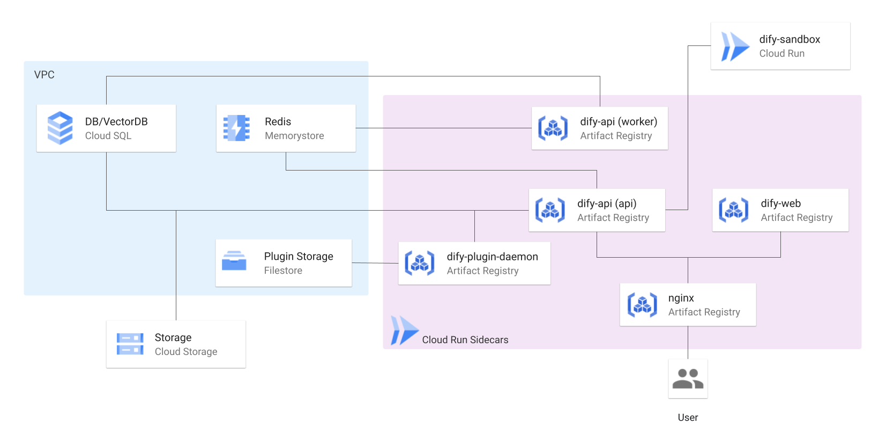

# Terraform for Dify on Google Cloud




<a href="../../"></a>

## 概要
本レポジトリでは、Terraform により自動で Google Cloud のリソースを立ち上げ、Dify を高可用構成でデプロイすることが可能です。

## 特徴
- サーバーレスホスティング
- オートスケール
- データ永続化

## 事前準備
- Google Cloud アカウント
- Terraform インストール済み
- gcloud CLI インストール済み

### 必要なAPIの有効化

Difyのデプロイに必要なGoogle Cloud APIを一括で有効化します：

```sh
# プロジェクトIDを設定（例：your-project-id）
export PROJECT_ID="your-project-id"

# 必要なAPIを一括有効化
gcloud services enable \
  artifactregistry.googleapis.com \
  compute.googleapis.com \
  servicenetworking.googleapis.com \
  redis.googleapis.com \
  vpcaccess.googleapis.com \
  run.googleapis.com \
  storage.googleapis.com \
  sqladmin.googleapis.com \
  file.googleapis.com \
  cloudbuild.googleapis.com \
  containerregistry.googleapis.com \
  --project=$PROJECT_ID
```

有効化されたAPIの確認：
```sh
gcloud services list --enabled --project=$PROJECT_ID --filter="name:(artifactregistry OR compute OR servicenetworking OR redis OR vpcaccess OR run OR storage OR sqladmin OR file OR cloudbuild OR containerregistry)" --format="table(name,title)"
```

### Terraform State管理用バケットの作成と設定

Terraformの状態ファイルを保存するGCSバケットを作成し、設定を自動更新します：

```sh
# Terraform state用GCSバケットを作成（既存の場合はスキップ）
export BUCKET_NAME="${PROJECT_ID}-terraform-state-dify"

# バケットの存在確認と作成
if ! gsutil ls -p $PROJECT_ID gs://$BUCKET_NAME 2>/dev/null; then
    echo "Creating bucket: gs://$BUCKET_NAME"
    gsutil mb -p $PROJECT_ID -c STANDARD -l asia-northeast1 gs://$BUCKET_NAME
else
    echo "Bucket already exists: gs://$BUCKET_NAME"
fi

# provider.tfのバケット名を自動更新
cd terraform/environments/dev
sed -i.bak "s/your-tfstate-bucket/$BUCKET_NAME/g" provider.tf

# 変更を確認
echo "Updated provider.tf:"
grep -n "bucket.*=" provider.tf
```

バケットの作成確認：
```sh
gsutil ls -p $PROJECT_ID | grep terraform-state-dify
```

## 設定
- `terraform/environments/dev/terraform.tfvars` ファイルで環境固有の値を設定します。
> [!WARNING]
> **セキュリティ警告: `terraform.tfvars` の取り扱い**
> リポジトリ内の `terraform/environments/dev/terraform.tfvars` は **テンプレート** です。実際の値 (プロジェクトID, 機密情報, 安全なパスワード) はローカルで設定してください。
>
> **❗️ 機密情報を含む `terraform.tfvars` を Git にコミットしないでください。** 重大なセキュリティリスクとなります。
>
> 誤コミット防止のため、すぐに `*.tfvars` を `.gitignore` に追加してください。安全な管理には環境変数 (`TF_VAR_...`) や Google Secret Manager 等の利用を推奨します。

- Terraform stateを管理するGCSバケットは上記の自動化コマンドで作成・設定されます。手動で設定する場合は、`terraform/environments/dev/provider.tf`ファイルの"your-tfstate-bucket"を作成したバケット名に置換してください。

## 始め方
1. リポジトリをクローン:
    ```sh
    git clone https://github.com/DeNA/dify-google-cloud-terraform.git
    ```

2. Terraformを初期化:
    ```sh
    cd terraform/environments/dev
    terraform init
    ```

3. Artifact Registry リポジトリを作成:
    ```sh
    terraform apply -target=module.registry
    ```

4. コンテナイメージをビルド＆プッシュ:
    ```sh
    cd ../../..
    sh ./docker/cloudbuild.sh <your-project-id> <your-region>
    ```
    また、dify-api イメージのバージョンを指定することもできます。
    ```sh
    sh ./docker/cloudbuild.sh <your-project-id> <your-region> <dify-api-version>
    ```
    バージョンを指定しない場合、デフォルトで最新バージョンが使用されます。

5. Terraformをプランニング:
    ```sh
    cd terraform/environments/dev
    terraform plan
    ```

6. Terraformを適用:
    ```sh
    terraform apply
    ```

## 自動デプロイ（推奨）

手動でのステップ実行が面倒な場合は、以下の自動デプロイスクリプトを使用してください：

```sh
# スクリプトに実行権限を付与（初回のみ）
chmod +x deploy-dify.sh

# 一括デプロイ実行
./deploy-dify.sh <your-project-id> <your-region>
```

このスクリプトは以下の処理を自動実行します：
1. 必要なGoogle Cloud APIの一括有効化
2. Terraform State管理用バケットの作成と設定
3. Terraformの初期化
4. terraform.tfvarsのPROJECT_IDとregionの自動置換
5. Artifact Registry リポジトリの作成
6. コンテナイメージのビルド＆プッシュ
7. Terraformの適用（--auto-approve）
8. DifyのWebアプリケーションURLの表示

**例:**
```sh
./deploy-dify.sh my-gcp-project asia-northeast1
```

**注意事項:**
- 初回実行前にgcloud CLIでプロジェクトにログインしていることを確認してください
- スクリプト実行には数十分かかる場合があります
- エラーが発生した場合は、各ステップを手動で実行してください

## デプロイ完了後の確認

### DifyのWebアプリケーションURLを確認

```sh
# Cloud RunサービスのURLを確認
gcloud run services list \
  --project=$PROJECT_ID \
  --region=asia-northeast1 \
  --format="table(metadata.name,status.url)"
```

### Difyにアクセス

```sh
# DifyのメインサービスURLを取得
DIFY_URL=$(gcloud run services describe dify-service \
  --project=$PROJECT_ID \
  --region=asia-northeast1 \
  --format="value(status.url)")

echo "Dify Web Application URL: $DIFY_URL"
echo "ブラウザでアクセス: $DIFY_URL"

# URLを直接ブラウザで開く（macOSの場合）
open $DIFY_URL
```

### サービス状態の確認

```sh
# 全Cloud Runサービスの詳細状態を確認
gcloud run services list \
  --project=$PROJECT_ID \
  --region=asia-northeast1 \
  --format="table(metadata.name,status.url,status.conditions[0].type,status.conditions[0].status)"
```


## リソースの削除

### 自動削除スクリプト（推奨）
完全なリソース削除には以下の自動化スクリプトを使用してください：

```sh
# スクリプトに実行権限を付与（初回のみ）
chmod +x cleanup-resources.sh

# リソース削除実行
./cleanup-resources.sh <your-project-id>
```

このスクリプトは以下の処理を自動実行します：
1. Cloud SQL データベースの削除
2. Cloud SQL インスタンスの削除
3. Cloud Storage バケットの削除
4. VPC Peering の削除
5. デフォルトルートの自動検出・削除
6. VPC ネットワークの削除
7. Terraform destroy の実行

### 手動削除（スクリプトが使用できない場合）
スクリプトが使用できない場合は、以下のコマンドを順番に実行してください：

```sh
# 環境変数設定
export PROJECT_ID="your-project-id"

# 1. Cloud SQL Database の削除
gcloud sql databases delete dify --instance=postgres-instance --project=$PROJECT_ID --quiet
gcloud sql databases delete dify_plugin --instance=postgres-instance --project=$PROJECT_ID --quiet

# 2. Cloud SQL インスタンスの削除
gcloud sql instances delete postgres-instance --project=$PROJECT_ID --quiet

# 3. Cloud Storage の削除
gsutil rm -r "gs://${PROJECT_ID}_dify"

# 4. VPC Peering の削除
gcloud compute networks peerings delete servicenetworking-googleapis-com --network=dify-vpc --project=$PROJECT_ID --quiet

# 5. VPC ネットワークの削除
# デフォルトルートがある場合は先に削除
gcloud compute routes list --filter="network:dify-vpc AND name~default-route" --project=$PROJECT_ID --format="value(name)" | xargs -I {} gcloud compute routes delete {} --project=$PROJECT_ID --quiet
gcloud compute networks delete dify-vpc --project=$PROJECT_ID --quiet

# 6. Terraform destroy
cd terraform/environments/dev
terraform destroy -auto-approve
```

## 参照
- [Dify](https://dify.ai/)
- [GitHub](https://github.com/langgenius/dify)

## ライセンス
このソフトウェアはMITライセンスの下でライセンスされています。詳細はLICENSEファイルを参照してください。
